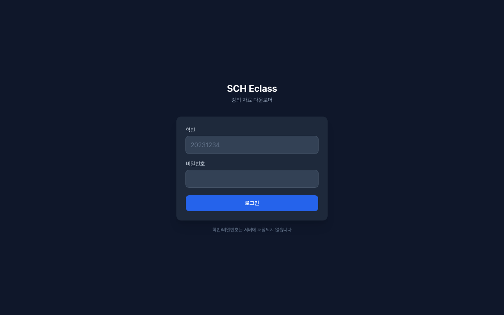

# SCH Eclass 파일 다운로더

순천향대학교 Eclass(medlms.sch.ac.kr) 강의 자료를 웹 브라우저에서 편리하게 다운로드할 수 있는 서비스입니다.

**배포 주소**: https://class-file-auto-web.vercel.app/

---

## 화면

### 로그인



---

## 주요 기능

- **SSO 로그인** — 학번/비밀번호로 순천향대 SSO 인증 (RSA 암호화 전송)
- **강의 목록 조회** — 현재 학기 수강 중인 강의 자동 조회
- **파일 목록 조회** — 강의콘텐츠 / 강의자료실 / 과제 및 평가 통합 파일 목록
- **파일 다운로드** — 개별 다운로드 및 선택 일괄 다운로드
- **보안** — 학번/비밀번호 서버 미저장, iron-session 암호화 쿠키, IP 기반 Rate Limiting

---

## 기술 스택

| 분류 | 사용 기술 |
|------|-----------|
| Framework | Next.js 15 (App Router) |
| Language | TypeScript |
| Styling | Tailwind CSS |
| Session | iron-session |
| 인증 | SCH SSO + RSA 암호화 (node-forge) |
| HTML 파싱 | cheerio |
| 배포 | Vercel (도쿄 리전, hnd1) |

---

## 프로젝트 구조

```
web/
├── src/
│   ├── app/
│   │   ├── page.tsx                    # 로그인 페이지
│   │   ├── dashboard/
│   │   │   ├── page.tsx                # 강의 목록
│   │   │   └── [courseId]/page.tsx     # 파일 목록 및 다운로드
│   │   └── api/
│   │       ├── auth/login/route.ts     # 로그인 API
│   │       ├── auth/logout/route.ts    # 로그아웃 API
│   │       ├── courses/route.ts        # 강의 목록 API
│   │       ├── courses/[id]/files/     # 파일 목록 API
│   │       └── download/route.ts       # 파일 다운로드 프록시
│   └── lib/
│       ├── session.ts                  # iron-session 설정
│       ├── cookie-jar.ts               # SSO 리다이렉트 쿠키 관리
│       └── eclass/
│           ├── auth.ts                 # SSO 인증 로직
│           ├── crawler.ts              # LearningX API 크롤러
│           └── rsa.ts                  # RSA 암호화
└── vercel.json                         # 배포 설정 (hnd1 리전)
```

---

## 인증 흐름

```
eclass.sch.ac.kr/mypage
  → SSO 리다이렉트 체인
  → RSA 암호화 로그인 (sso.sch.ac.kr)
  → medlms.sch.ac.kr xn_api_token 획득
  → iron-session 암호화 쿠키 저장
```

---

## 로컬 실행

```bash
# 의존성 설치
npm install

# 환경변수 설정
cp .env.local.example .env.local
# SESSION_SECRET=<32자 이상 랜덤 문자열> 입력

# 개발 서버 실행
npm run dev
```

---

## 보안 설계

| 항목 | 내용 |
|------|------|
| 비밀번호 | RSA 암호화 전송, 서버 미저장 |
| 세션 | iron-session AES 암호화 HttpOnly 쿠키 |
| SSRF 방지 | 다운로드 URL 도메인 화이트리스트 (sch.ac.kr) |
| Brute Force | IP당 1분 5회 로그인 제한 |
| courseId | 수강 강의 소유권 검증 |

---

## 관련 저장소

- **CLI 버전**: [ClassFileAuto](https://github.com/KimHands/classfileauto) — Python 기반 스케줄러 + Discord 알림

---

## 제작

Made by SCH CSE 23학번 김종건
© 2026 KIM JONG GUN. All rights reserved.
