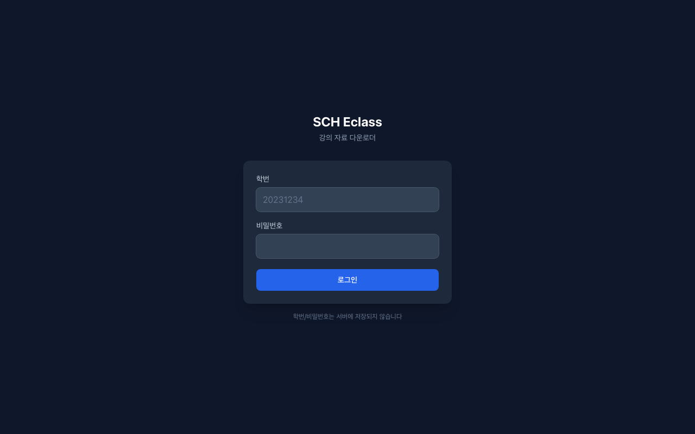
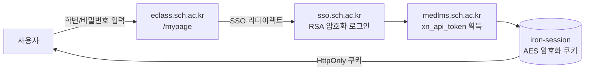

# SCH Eclass 파일 다운로더 (Web)

> 순천향대 Eclass(medlms.sch.ac.kr) 강의 자료를 **브라우저에서** 모아 다운로드. SSO RSA 암호화 · iron-session 기반 보안 설계

[](https://nextjs.org)
[](https://www.typescriptlang.org)
[](https://tailwindcss.com)
[](https://github.com/vvo/iron-session)
[](https://vercel.com)

**배포 주소**: https://class-file-auto-web.vercel.app/

| 항목 | 내용 |
|---|---|
| 대상 | `medlms.sch.ac.kr` (SSO + LearningX) |
| 형태 | Vercel 서버리스 웹 앱 |
| 본인 담당 | 단독 개발 (SSO 인증 · API 라우트 · 보안 설계 · 법적 근거 검토) |
| 관련 저장소 | CLI 버전: [classfileauto](https://github.com/KimHands/classfileauto) |

---

## 화면

### 로그인



---

## 주요 기능

- **SSO 로그인** — 학번/비밀번호로 순천향대 SSO 인증 (RSA 암호화 전송)
- **강의 목록 조회** — 현재 학기 수강 중인 강의 자동 조회
- **파일 목록 조회** — 강의콘텐츠 / 강의자료실 / 과제 및 평가 통합 파일 목록
- **파일 다운로드** — 개별 다운로드 및 선택 일괄 다운로드
- **보안** — 학번/비밀번호 서버 미저장, iron-session 암호화 쿠키, IP 기반 Rate Limiting

---

## 기술 스택

| 분류 | 사용 기술 |
|------|-----------|
| Framework | Next.js 15 (App Router) |
| Language | TypeScript |
| Styling | Tailwind CSS |
| Session | iron-session |
| 인증 | SCH SSO + RSA 암호화 (node-forge) |
| HTML 파싱 | cheerio |
| 배포 | Vercel (도쿄 리전, hnd1) |

---

## 프로젝트 구조

```
web/
├── src/
│   ├── app/
│   │   ├── page.tsx                    # 로그인 페이지
│   │   ├── dashboard/
│   │   │   ├── page.tsx                # 강의 목록
│   │   │   └── [courseId]/page.tsx     # 파일 목록 및 다운로드
│   │   └── api/
│   │       ├── auth/login/route.ts     # 로그인 API
│   │       ├── auth/logout/route.ts    # 로그아웃 API
│   │       ├── courses/route.ts        # 강의 목록 API
│   │       ├── courses/[id]/files/     # 파일 목록 API
│   │       └── download/route.ts       # 파일 다운로드 프록시
│   └── lib/
│       ├── session.ts                  # iron-session 설정
│       ├── cookie-jar.ts               # SSO 리다이렉트 쿠키 관리
│       └── eclass/
│           ├── auth.ts                 # SSO 인증 로직
│           ├── crawler.ts              # LearningX API 크롤러
│           └── rsa.ts                  # RSA 암호화
└── vercel.json                         # 배포 설정 (hnd1 리전)
```

---

## 인증 흐름


```mermaid
flowchart LR
    User[사용자]
    Eclass[eclass.sch.ac.kr<br/>/mypage]
    SSO[sso.sch.ac.kr<br/>RSA 암호화 로그인]
    Medlms[medlms.sch.ac.kr<br/>xn_api_token 획득]
    Session[(iron-session<br/>AES 암호화 쿠키)]

    User -->|학번/비밀번호 입력| Eclass
    Eclass -->|SSO 리다이렉트| SSO
    SSO --> Medlms
    Medlms --> Session
    Session -->|HttpOnly 쿠키| User
```

---

## 로컬 실행

```bash
# 의존성 설치
npm install

# 환경변수 설정
cp .env.local.example .env.local
# SESSION_SECRET=<32자 이상 랜덤 문자열> 입력

# 개발 서버 실행
npm run dev
```

---

## 보안 설계

| 항목 | 내용 |
|------|------|
| 비밀번호 | RSA 암호화 전송, 서버 미저장 |
| 세션 | iron-session AES 암호화 HttpOnly 쿠키 |
| SSRF 방지 | 다운로드 URL 도메인 화이트리스트 (sch.ac.kr) |
| Brute Force | IP당 1분 5회 로그인 제한 |
| courseId | 수강 강의 소유권 검증 |

---

## 법적 근거

### 개인정보 제3자 제공 동의 (개인정보보호법 제17조)

이 서비스는 로그인 처리를 위해 학번·비밀번호가 Vercel 외부 서버(일본 도쿄)를 경유합니다.
**개인정보보호법 제17조 제1항 제1호**에 따라 정보주체(사용자)의 명시적 동의를 받은 경우 제3자 제공이 허용되며, 로그인 화면에서 아래 내용을 고지하고 동의를 받습니다.

| 항목 | 내용 |
|------|------|
| 제공받는 자 | Vercel Inc. (외부 서버, 일본 도쿄) |
| 제공 항목 | 학번, 비밀번호 |
| 이용 목적 | SCH Eclass 강의자료 다운로드 서비스 제공 |
| 보유 기간 | 세션 유지 시간 (최대 8시간, 서버 미저장) |

동의 체크박스 미선택 시 로그인 버튼이 비활성화되며, 동의를 거부할 권리가 있습니다.

### 강의자료 다운로드 (저작권법 제30조)

저작권법 제30조(사적 이용을 위한 복제)에 따라 공표된 저작물을 **영리 목적 없이 개인적으로 이용**하기 위한 복제는 허용됩니다. 이 서비스는 본인이 수강 중인 강의의 자료를 개인 보관 목적으로 다운로드하는 용도로만 사용해야 합니다.

> **주의**: 다운로드한 강의자료를 타인에게 공유하거나 재배포하는 행위는 저작권법 위반입니다.

### 자동화 접근 (정보통신망법)

대법원 2022. 5. 12. 선고 2021도1533 판결 기준, 이용약관에 자동화 금지가 명시되지 않고 기술적 접근 차단이 없는 경우 정보통신망법 위반으로 보지 않습니다. SCH Eclass/medlms에는 자동화를 금지하는 이용약관이 별도로 존재하지 않습니다.

---

## 관련 저장소

- **CLI 버전**: [ClassFileAuto](https://github.com/KimHands/classfileauto) — Python 기반 스케줄러 + Discord 알림

---

## 제작

Made by SCH CSE 23학번 김종건
© 2026 KIM JONG GUN. All rights reserved.
